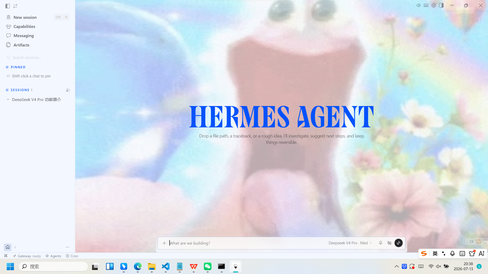

# EneHermester

基于 [Hermes Agent](https://github.com/NousResearch/hermes-agent) 改造的桌面端 AI 助手，使用 Electron + React + Python 构建。

## 运行截图



## 功能特性

- **原生桌面体验** — Electron 窗口，支持 Windows / macOS / Linux
- **流式对话** — 实时 AI 回复，工具调用过程可视化
- **自定义背景** — 支持个性化背景图片，主题色自动适配
- **多会话管理** — 侧边栏切换会话，支持搜索历史记录
- **终端集成** — 内置 xterm.js 终端，AI 可直接操作命令行
- **文件预览** — 右侧面板预览代码、图片、网页

## 技术栈

| 层 | 技术 |
|---|---|
| 桌面框架 | Electron 40 |
| 前端 | React 19 + TypeScript + Tailwind CSS + Vite |
| 状态管理 | nanostores |
| AI 后端 | Python (Hermes Agent) |
| 通信协议 | WebSocket JSON-RPC |

## 快速开始

### 环境要求

- **Node.js** >= 20.19 或 >= 22.12
- **Python** >= 3.11, < 3.14
- **Git**
- **npm**

### 安装与启动

```bash
# 1. 克隆仓库
git clone git@github.com:entyame/EneHermester.git
cd EneHermester

# 2. 安装依赖
npm install

# 3. 配置 Python 虚拟环境（可选，项目自带了 .venv）
# 如需要：python -m venv .venv && .venv\Scripts\activate

# 4. 构建桌面应用
cd apps\desktop
npm run build

# 5. 启动（开发模式）
npm run dev
```

或直接双击项目根目录的 **`start-desktop.bat`** 一键启动。

### 配置 API 密钥

在 `workspace\.env` 中配置你的 API 密钥：

```env
OPENAI_API_KEY=sk-xxx
ANTHROPIC_API_KEY=sk-ant-xxx
```

## 项目结构

```
EneHermester/
├── apps/
│   ├── desktop/          # Electron + React 桌面应用
│   │   ├── electron/     # Electron 主进程（TypeScript）
│   │   ├── src/          # React 渲染进程
│   │   ├── public/       # 静态资源（背景图、图标等）
│   │   ├── assets/       # 应用图标
│   │   └── scripts/      # 构建脚本
│   └── shared/           # 共享 TypeScript 库
├── agent/                # AI Agent 核心（Python）
├── tools/                # 工具实现（终端、文件、浏览器等）
├── plugins/              # 模型提供商插件
├── skills/               # 内置技能
├── tui_gateway/          # Python JSON-RPC 后端
├── workspace/            # 运行时数据（配置、会话、日志）
├── start-desktop.bat     # 一键启动脚本
└── start-desktop.ps1     # PowerShell 启动脚本
```

## 自定义

### 更换应用图标

把新图标放到 `apps/desktop/assets/` 下：

| 文件 | 用途 |
|---|---|
| `icon.png` | 通用图标（1024×1024） |
| `icon.ico` | Windows 图标 |
| `icon.icns` | macOS 图标 |

### 更换背景图片

1. 把图片放到 `apps/desktop/public/` 下
2. 修改 `apps/desktop/src/styles.css`，搜索 `background01.jpg` 替换为你的文件名
3. 调整透明度：修改 `color-mix(... 70% ...)` 中的百分比

### 更换主题

应用中按 `Shift + X` 切换亮色/暗色模式，或在设置中选择主题皮肤。

## 致谢

本项目基于 [Nous Research](https://nousresearch.com) 开源的 [Hermes Agent](https://github.com/NousResearch/hermes-agent) 构建，原始项目采用 MIT 许可证。
